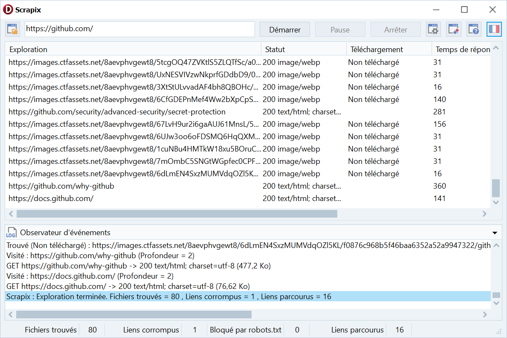

# Scrapix
Scrapix, un « Aspirateur » (Web Crawler)

Scrapix, un « aspirateur » web (web crawler) simple orienté VCL qui gère : la récupération HTTP, l’extraction de liens et de ressources (images, documents, audio, vidéo, ressources web), le respect optionnel de robots.txt, un mécanisme facultatif de téléchargement des ressources, des limites (nombre de fichiers trouvés, nombre de pages explorées), et des mises à jour UI thread-safe vers un TscListView et un TscStatusBar.

Le crawler est conçu pour être lancé depuis un thread d’arrière-plan et pour mettre à jour l’interface en toute sécurité via des wrappers TThread.Queue.
Il expose des commandes pour démarrer, mettre en pause, reprendre, annuler et attendre l’arrêt.

# Compatibilité générale
TScrapix cible les environnements VCL Windows et nécessite des fonctionnalités RTL/CiE présentes dans les versions modernes de Delphi. En pratique, l’unité est utilisable avec Delphi récents (XE8 et ultérieurs) jusqu’aux versions récentes de RAD Studio

# Unités et fonctionnalités minimales requises
- System.Net.HttpClient et System.Net.URLClient (THTTPClient, IHTTPResponse) pour les requêtes HTTP.
- System.Threading (TTask, TThread) pour exécution asynchrone et Sleep non bloquant.
- System.Generics.Collections (TDictionary), System.SyncObjs (TEvent, TCriticalSection).
- System.Types / System.SysUtils / System.Classes / System.IOUtils (TURI, TPath, TFile, TDirectory, TStringList).
- System.RegularExpressions (TRegEx).
- Vcl controls (TListView/TStatusBar/TCheckListBox replacements utilisés ici : TscListView, TscStatusBar, TscCheckListBox, TscListBox — fournis par StyleControls ou à remplacer par composants VCL natifs si nécessaire).

# Les composants StyleControls dans UScrapix.pas peut-être remplacé par :
- TscButton -> TButton
- TscEdit -> TEdit
- TscPanel -> TPanel
- TscListView -> TListView
- TscSplitView ->TSplitView
- TscScrollBox -> TScrollBox
- TscLabel -> TTscLabel
- TscSpinEdit -> TSpinEdit
- TscCheckBox -> TCheckBox
- TscCheckListBox -> TCheckListBox
- TscListBox -> TListBox
- TscStatusBar -> TStatusBar
- TscExPanel -> Non remplaçable ! Composant StyleControls
